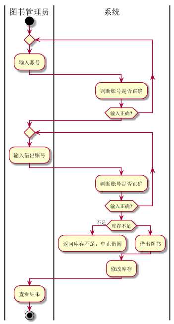
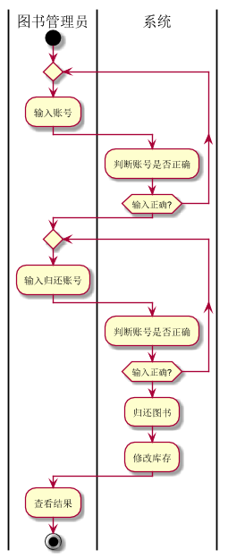
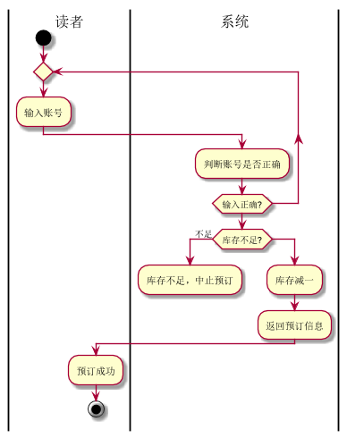
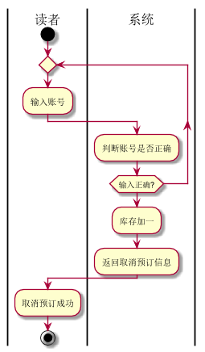
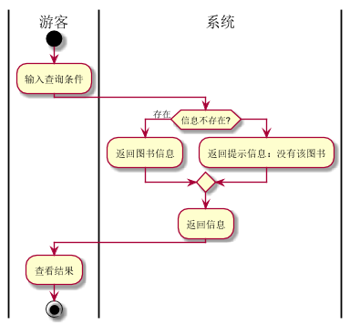
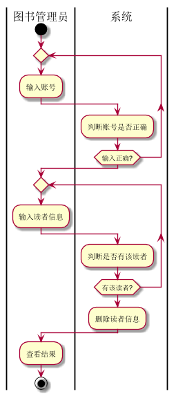
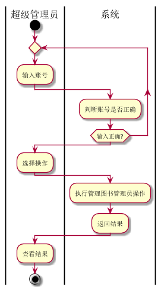

# 实验2：图书管理系统用例建模
|      学号    |    班级        |    姓名      |     照片  |   
|:------------:|:-------------- | ------------:|:--------- | 
| 201510414204 | 软件（本） 15-2|   杜芙宁     |     无    |  
## 1. 图书管理系统的用例关系图
### 1.1 用例图PlantUML源码如下：
```
@startuml
skinparam packageStyle rectangle

:超级管理员: as root
:图书管理员: as manage
:游客: as visitor
:读者: as reader
rectangle  {
	left to right direction
	root -> (维护图书管理员信息)
	manage --> (读者管理)
	manage -> (借阅管理)
	manage --> (图书管理)

	(查询图书)<--visitor
	(借阅情况查询)<--reader
	(预定图书)<--reader
	(取消预定)<--reader
  (借阅管理)<.(借出图书):include
   (归还图书).>(借阅管理):include
   (读者管理)<.(增加读者):include
   (删除读者).>(读者管理):include
    (增入图书).>(图书管理):include
    (图书管理)<.(注销图书):include
    (预定图书) .> (取消预定) : extends


}
reader-|>visitor
manage <|- root

@enduml

```
### 1.2 用例图如下：

## 2. 参与者说明：
### 2.1 图书管理员
主要职责是：读者管理，图书管理，借阅管理
### 2.2 超级管理员
主要职责是：拥有图书管理员的所有功能，同时维护图书管理员的信息。
### 2.2 游客
主要职责是：查询图书
### 2.2 读者
主要职责是：拥有游客所有功能，同时可预订图书，取消预订，查阅借阅情况
## 3. 用例规约表：
### 3.1“借出图书”用例

#### 3.1.1“借出图书”用例规约

|用例名称|借出图书|
|:-----------:|:-----------------------:|
|参与者|图书管理员|
|前置条件|登录图书管理员账号|
|后置条件|借出图书成功|
|主事件流|
|参与者动作|系统行为|
|1.输入账号<br><br><br>3.输入借出账号<br><br><br>7.查看结果|<br>2.判断账号是否正确<br>4.判断账号是否合法<br>5.判断图书库存<br>6.借出图书<br>7.修改库存|
|备选事件流|
|1a.账号不正确<br>1.系统提示账号错误<br>2a.库存不足<br>系统提示库存不足|
|业务规则|
|1.系统允许图书管理员执行借出图书操作|

##### 3.1.2“借出图书”用例流程图源码如下：
~~~
@startuml
|图书管理员|
start
repeat
	:输入账号;
	|系统|
	:判断账号是否正确;
repeat while (输入正确?)
|图书管理员|
repeat
	:输入借出账号;
	|系统|
	:判断账号是否正确;
repeat while (输入正确?)
|系统|
if (库存不足) then (不足)
	:返回库存不足，中止借阅;
	detach
else
	:借出图书;
endif
:修改库存;

|图书管理员|
:查看结果;

stop
@enduml
~~~

#### 3.1.3“借出图书”用例流程图如下
    

### 3.2“归还图书”用例

#### 3.2.1“归还图书”用例规约

|用例名称|归还图书|
|:-----------:|:-----------------------:|
|参与者|图书管理员|
|前置条件|登录图书管理员账号|
|后置条件|归还图书成功|
|主事件流|
|参与者动作|系统行为|
|1.输入账号<br><br><br>3.输入归还账号<br><br><br>7.查看结果|<br>2.判断账号是否正确<br>4.判断账号是否合法<br>5.判断用户是否借入图书<br>6.归还图书<br>7.修改库存|
|备选事件流|
|1a.账号不正确<br>1.系统提示账号错误<br>2a.用户未借图书<br>系统提示用户未借图书|
|业务规则|
|1.系统允许图书管理员执行归还图书操作|

#### 3.2.2“归还图书”用例流程图源码如下：
~~~

@startuml
|图书管理员|
start
repeat
	:输入账号;
	|系统|
	:判断账号是否正确;
repeat while (输入正确?)
|图书管理员|
repeat
	:输入归还账号;
	|系统|
	:判断账号是否正确;
repeat while (输入正确?)
|系统|
:归还图书;
:修改库存;
|图书管理员|
:查看结果;

stop
@enduml
~~~
#### 3.2.3“归还图书”用例流程图如下
    


### 3.3“预定图书”用例
#### 3.3.1“预定图书”用例规约
|用例名称|预定图书|
|:-----------:|:-----------------------:|
|参与者|读者|
|前置条件|读者登录到系统|
|后置条件|预定图书成功|
|主事件流|
|参与者动作|系统行为|
|1.读者输入账号预订<br><br><br><br>5.预订成功|<br>2.系统确认账号<br>3.系统确认库存是否充足<br>4.系统修改图书库存|
|备选事件流|
|1a.账号错误<br>1.系统提示账号错误，重新输入2a.库存不足<br>2.系统提示库存不足，中止预订|
|业务规则|
|1.系统允许多个读者同时预订图书，并根据库存对应返回是否成功<br>2.读者只能预订有库存的图书|
#### 3.3.2“预定图书”用例流程图源码如下：
   ~~~
   @startuml
   |读者|
   start
   repeat
   	:输入账号;
   	|系统|
   	:判断账号是否正确;
   repeat while (输入正确?)
   if(库存不足?) then (不足)
   	:库存不足，中止预订;
   	detach
   else
   	:库存减一;
   :返回预订信息;
   |读者|
   :预订成功;
   
   stop
   @enduml
   ~~~
   #### 3.3.3“预定图书”用例流程图如下**
  
  
   
 
   
   ### 3.4“取消预定”用例
   #### 3.4.1“取消预定”用例规约
  
|用例名称|取消预定|
|:-----------:|:-----------------------:|
|参与者|读者|
|前置条件|读者登录到系统|
|后置条件|取消预定图书成功|
|主事件流|
|参与者动作|系统行为|
|1.读者输入账号取消预订<br><br><br>4.取消预订成功|<br>2.系统确认账号<br>3.系统修改图书库存|
|备选事件流|
|1a.账号错误<br>1.系统提示账号错误，重新输入|
|业务规则|
|1.系统允许多个读者同时取消预订图书，并根据库存对应返回是否成功<br>2.读者只能取消预订已预订的图书|
 #### 3.4.2“取消预定”用例流程图源码如下：
      ~~~
      @startuml
      |读者|
      start
      repeat
      	:输入账号;
      	|系统|
      	:判断账号是否正确;
      repeat while (输入正确?)
      :库存加一;
      :返回取消预订信息;
      |读者|
      :取消预订成功;
      
      stop
      @enduml
      ~~~
  #### 3.4.3“预定图书”用例流程图如下
     
   
   
   
   ### 3.5“查询图书”用例
   #### 3.5.1“查询图书”用例规约
  |用例名称|查询图书|
  |:-----------:|:-----------------------:|
  |参与者|游客|
  |前置条件|打开系统|
  |后置条件|查询图书信息成功|
  |主事件流|
  |参与者动作|系统行为|
  |1.输入查询条件<br><br><br>3.查询图书结果|<br>2.系统查询图书信息<br>|
  |备选事件流|
  |1a.图书信息不存在<br>1.系统提示无图书|
  |业务规则|
  |1.系统允许多个游客同时查询图书，并根据信息对应返回<br>2.游客只能查询图书|
  #### 3.5.2“查询图书”用例流程图源码如下：
      ~~~
    @startuml
    |游客|
    start
    	:输入查询条件;
    	|系统|
    if(信息不存在?) then (存在)
    	:返回图书信息;
    else 
    	:返回提示信息：没有该图书;
    endif
    :返回信息;
    |游客|
    :查看结果;
    
    stop
    @enduml
    
    

      ~~~
   #### 3.5.3“查询图书”用例流程图如下
     


### 3.6“增加读者”用例
   #### 3.6.1“增加读者”用例规约
  |用例名称|增加读者|
  |:-----------:|:-----------------------:|
  |参与者|图书管理员|
  |前置条件|登录图书管理员账号|
  |后置条件|增加读者成功|
  |主事件流|
  |参与者动作|系统行为|
  |1.输入账号<br><br><br>3.输入添加的读者信息<br><br><br>6.查看结果|<br>2.判断账号是否正确<br>4.判断是否有该读者<br>5.添加读者|
  |备选事件流|
  |1a.账号不正确<br>1.系统提示账号错误<br>2a.已经有该读者信息
  |业务规则|
  |1.系统允许图书管理员执行添加读者操作|
  #### 3.6.2“添加读者”用例流程图源码如下：
      ~~~
    @startuml
    |图书管理员|
    start
    repeat
    	:输入账号;
    	|系统|
    	:判断账号是否正确;
    repeat while (输入正确?)
    |图书管理员|
    repeat
    	:输入读者信息;
    	|系统|
    	:判断是否有该读者;
    repeat while (无该读者?)
    |系统|
    
    :添加读者信息;
    |图书管理员|
    :查看结果;
    
        stop
        @enduml
      ~~~
   #### 3.6.3“添加读者”用例流程图如下
     

### 3.7“删除读者”用例
   #### 3.7.1“删除读者”用例规约
  |用例名称|删除读者|
  |:-----------:|:-----------------------:|
  |参与者|图书管理员|
  |前置条件|登录图书管理员账号|
  |后置条件|删除读者成功|
  |主事件流|
  |参与者动作|系统行为|
  |1.输入账号<br><br><br>3.输入删除的读者信息<br><br><br>6.查看结果|<br>2.判断账号是否正确<br>4.判断是否有该读者<br>5.删除读者|
  |备选事件流|
  |1a.账号不正确<br>1.系统提示账号错误<br>2a.无该读者信息
  |业务规则|
  |1.系统允许图书管理员执行添加读者操作|
  #### 3.7.2“删除读者”用例流程图源码如下：
      ~~~
    @startuml
    |图书管理员|
    start
    repeat
    	:输入账号;
    	|系统|
    	:判断账号是否正确;
    repeat while (输入正确?)
    |图书管理员|
    repeat
    	:输入读者信息;
    	|系统|
    	:判断是否有该读者;
    repeat while (有该读者?)
    |系统|
    
    :删除读者信息;
    |图书管理员|
    :查看结果;
    
        stop
        @enduml
      ~~~
   #### 3.7.3“删除读者”用例流程图如下
     


### 3.8“维护图书管理员”用例
   #### 3.8.1“维护图书管理员”用例规约
|用例名称|借出图书|
|:-----------:|:-----------------------:|
|参与者|图书管理员|
|前置条件|登录图书管理员账号|
|后置条件|借出图书成功|
|主事件流|
|参与者动作|系统行为|
|1.输入账号<br><br><br>3.输入借出账号<br><br><br>7.查看结果|<br>2.判断账号是否正确<br>4.判断账号是否正确<br>5.判断图书库存<br>6.借出图书<br>7.修改库存|
|备选事件流|
|1a.账号不正确<br>1.系统提示账号错误<br>2a.库存不足<br>系统提示库存不足|
|业务规则|
|1.系统允许图书管理员执行借出图书操作|
  #### 3.8.2“维护图书管理员”用例流程图源码如下：
      ~~~
    @startuml
    |超级管理员|
    start
    repeat
    	:输入账号;
    	|系统|
    	:判断账号是否正确;
    repeat while (输入正确?)
    |超级管理员|
    :选择操作;
    |系统|
    :执行管理图书管理员操作;
    :返回结果;
    
    |超级管理员|
    :查看结果;
    
    stop
    @enduml
      ~~~
   #### 3.8.3“维护图书管理员”用例流程图如下
     
********


