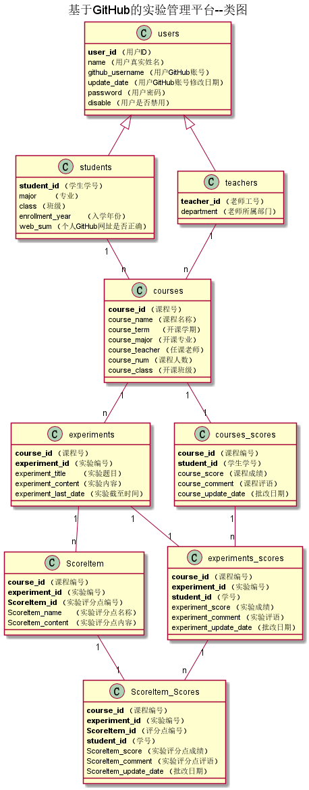

# 基于GitHub的实验管理平台的分析与设计

### 成都大学信息科学与工程学院

#

|学号|班级|姓名|照片|
|:-------:|:-------------: | :----------:|:---:|
|201510414204|软件(本)15-2|杜芙宁|无|

## 1. 概述
 基于GitHub的实验管理平台的分析与设计。实现了三多：一个老师可以上多门课，一人同学可以上多门课，一项实验有多个评分点 
学生的功能主要有：选择学期；选择课程；登录；登出；修改用户信息；查看用户信息；修改密码；查看实验；查看成绩 
老师的功能主要有：选择学期；选择课程；增删改查实验；评定学生成绩；查看学生成绩；登录；登出；修改用户信息；查看用户信息；修改密码； 
老师和学生都能通过本系统的链接方便地跳转到学生的每个GitHUB实验目录，以便批改实验或者查看实验情况。
实验成绩按数字分数计算，每项实验的满分为100分，最低为0分。

    
## 2. 系统总体结构
 
 界面设计参见：(https://dulaou.github.io/is_analysis/test6/ui/index.html)
## 3. 用例图设计[源码](./用例图.puml)

 
## 4. 类图设计[源码](./类图.puml)

## 5. 数据库设计
- ### [参见数据库设计](./数据库设计.md)
     
## 6. 界面及用例详细设计

### [“登录”用例](./用例/登录.md),[界面](https://dulaou.github.io/is_analysis/test6/ui/index.html)
### [“修改密码”用例](./用例/修改密码.md),[界面](https://dulaou.github.io/is_analysis/test6/ui/setpassword.html)
### [“修改用户信息”用例](./用例/修改用户信息.md),[界面](https://dulaou.github.io/is_analysis/test6/ui/setuserinfo.html)
### [“修改课程作业”用例](./用例/修改课程作业.md),[界面](https://dulaou.github.io/is_analysis/test6/ui/setexperiment.html)
### [“删除课程作业”用例](./用例/删除课程作业.md),[界面](https://dulaou.github.io/is_analysis/test6/ui/setexperiment.html)
### [“显示学生列表”用例](./用例/显示学生列表.md),[界面](https://dulaou.github.io/is_analysis/test6/ui/getstudentlist.html)
### [“显示课程信息”用例](./用例/显示课程信息.md),[界面](https://dulaou.github.io/is_analysis/test6/ui/getcourseinfo.html)
### [“查看学生成绩”用例](./用例/查看学生成绩.md),[界面](https://dulaou.github.io/is_analysis/test6/ui/getstudentscore.html)
### [“查看成绩”用例](./用例/查看成绩.md),[界面](https://dulaou.github.io/is_analysis/test6/ui/getscore.html)
### [“查看用户信息”用例](./用例/查看用户信息.md),[界面](https://dulaou.github.io/is_analysis/test6/ui/getuserinfo.html)
### [“查看课程作业”用例](./用例/查看课程作业.md),[界面](https://dulaou.github.io/is_analysis/test6/ui/getexpermient.html)
### [“添加课程作业”用例](./用例/添加课程作业.md),[界面](https://dulaou.github.io/is_analysis/test6/ui/setexperiment.html)
### [“登出”用例](./用例/登出.md),[界面](https://dulaou.github.io/is_analysis/test6/ui/shome.html)
### [“评定学生成绩”用例](./用例/评定学生成绩.md),[界面](https://dulaou.github.io/is_analysis/test6/ui/setscore.html)
### [“选择学期”用例](./用例/选择学期.md),[界面](https://dulaou.github.io/is_analysis/test6/ui/getterms.html)
### [“选择课程”用例](./用例/选择课程.md),[界面](https://dulaou.github.io/is_analysis/test6/ui/shome.html)

