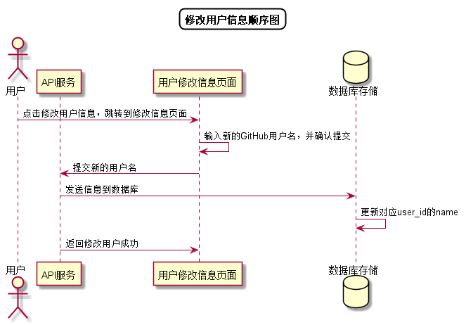

# “修改用户信息”用例 [返回](../README.md)
## 1. 用例规约

|用例名称|修改用户信息|
|-------|:-------------|
|功能|修改用户的GitHub用户名称|
|参与者|学生，老师|
|前置条件|成功登录|
|后置条件| |
|主事件流| 1.用户填写GitHub用户名称   2.用户提交修改信息  3.询问用户是否修改 4.如果‘是’则系统存储修改后的GitHub用户名称|
|备选事件流|1a. 如果用户输入的GitHub用户名称为空  &nbsp;&nbsp; 1.系统清空用户的GitHub用户名称|

## 2. 业务流程[源码](../顺序图/修改用户信息.puml)
 

## 3. 界面设计
- 界面参照: https://duolalu.github.io/is_analysis/test6/ui/setuserinfo.html
- API接口调用
    - 接口2：[setUserInfo](../接口/setUserInfo.md)
    
## 4. 算法描述
无
## 5. 参照表
- [USERS](../数据库设计.md/#USERS)
