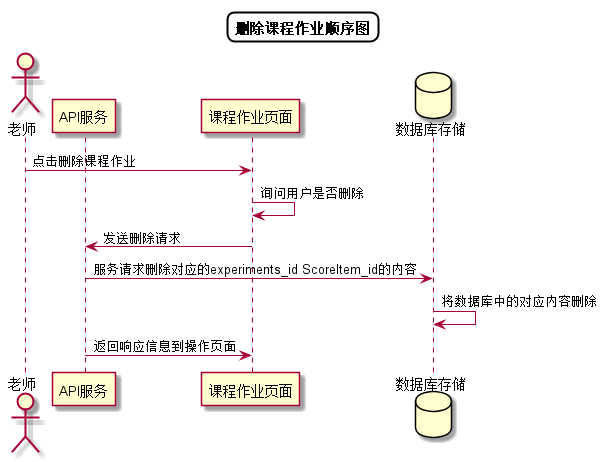

# “删除课程作业”用例 [返回](../README.md)
## 1. 用例规约

|用例名称|删除课程作业|
|-------|:-------------|
|功能|删除某门课程作业|
|参与者|老师|
|前置条件|成功登录系统|
|后置条件| |
|主事件流| 1.老师选择某门课程   2.删除课程作业  3.弹出框询问是否删除 4.老师点击‘是’系统删除课程作业并提示删除成功|
|备选事件流|1a. 如果老师点击否 &nbsp;&nbsp; 1.返回课程作业列表页面|

## 2. 业务流程[源码](../顺序图/删除课程作业.puml)

## 3. 界面设计
- 界面参照: https://duolalu.github.io/is_analysis/test6/ui/setexperiment.html
- API接口调用
    - 接口1：[delExperiment](../接口/delExperiment.md)

    
## 4. 算法描述
无
    
## 5. 参照表
- [USERS](../数据库设计.md/#USERS)
- [COURSES](../数据库设计.md/#COURSES)
