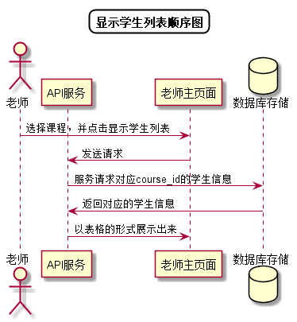

# “显示本课程学生列表”用例 [返回](../README.md)

## 1. 用例规约

|用例名称|显示本课程学生列表|
|-------|:-------------|
|功能|显示出所有学生的信息|
|参与者|老师|
|前置条件| 以老师的身份成功登录|
|后置条件||
|主事件流| 1. 老师选择任教课程 2.系统根据课程编号显示学生列表 |
|备选事件流|1a. 老师任教课程  &nbsp;&nbsp; 1.下拉菜单无选项   &nbsp;&nbsp;|

## 2. 业务流程 [源码](../顺序图/显示学生列表.puml)

## 3. 界面设计
- 界面参照: https://duolalu.github.io/is_analysis/test6/ui/getstudentlist.html
- API接口调用
    - 接口1：[getStudents](../接口/getStudents.md)

## 4. 算法描述
无
    
## 5. 参照表
- [USERS](../数据库设计.md/#USERS)
- [STUDENTS](../数据库设计.md/#STUDENTS)
- [COURSES](../数据库设计.md/#COURSES)
