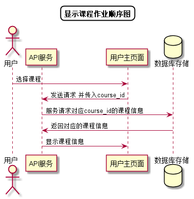

# “显示课程信息”用例 [返回](../README.md)

## 1. 用例规约

|用例名称|显示课程信息|
|-------|:-------------|
|功能|用户查看选择的课程的信息|
|参与者|学生，老师|
|前置条件| 成功登录|
|后置条件||
|主事件流| 1. 用户点击指定课程 2.系统显示对应的课程信息 |
|备选事件流||

## 2. 业务流程[源码](../顺序图/显示课程信息.puml)

## 3. 界面设计
- 界面参照: https://duolalu.github.io/is_analysis/test6/ui/getcourseinfo.html
- API接口调用
    - 接口1：[getCourseInfo](../接口/getCourseInfo.md)

## 4. 算法描述
无
## 5. 参照表
- [COURSES](../数据库设计/数据库设计.md/#COURSES)
