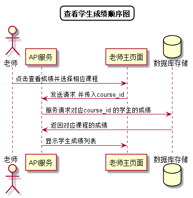

# “查看显示成绩”用例 [返回](../README.md)

## 1. 用例规约

|用例名称|查看学生成绩|
|-------|:-------------|
|功能|老师查看某门课程学生们的成绩|
|参与者|老师|
|前置条件| 成功登录|
|后置条件||
|主事件流| 1. 老师点击查看成绩并选择相应课程 2.系统根据课程号查询并返回成绩列表 |
|备选事件流||

## 2. 业务流程[源码](../顺序图/查看学生成绩.puml)

 

## 3. 界面设计
- 界面参照: https://duolalu.github.io/is_analysis/test6/ui/getstudentscore.html
- API接口调用
    - 接口1：[getStudentScore](../接口/getStudentScore.md)

## 4. 算法描述 
    
## 5. 参照表
- [STUDENTS](../数据库设计.md/#STUDENTS)
- [COURSES_SCORES](../数据库设计.md/#COURSES_SCORES)
