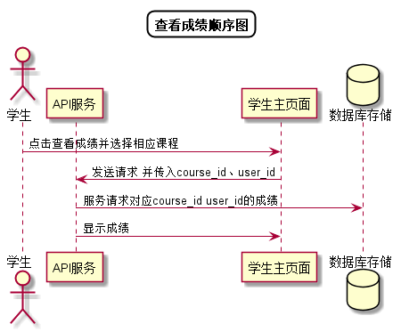

# “查看成绩”用例 [返回](../README.md)

## 1. 用例规约

|用例名称|查看成绩|
|-------|:-------------|
|功能|学生查看自己对应课程的成绩|
|参与者|学生|
|前置条件| 成功登录|
|后置条件||
|主事件流| 1. 学生点击查看成绩并选择相应课程 2.系统根据课程号以及学号查询并返回成绩 |
|备选事件流||

## 2. 业务流程[源码](../顺序图/查看成绩.puml)
 

## 3. 界面设计
- 界面参照: https://duolalu.github.io/is_analysis/test6/ui/getscore.html
- API接口调用
    - 接口1：[getScore](../接口/getScore.md)

## 4. 算法描述 
无
## 5. 参照表
- [STUDENTS](../数据库设计.md/#STUDENTS)
- [COURSES_SCORES](../数据库设计.md/#COURSES_SCORES)
- [EXPERIMENTS_SCORES](../数据库设计.md/#EXPERIMENTS_SCORES)
- [SCOREITEM_SCORES](../数据库设计.md/#SCOREITEM_SCORES)
