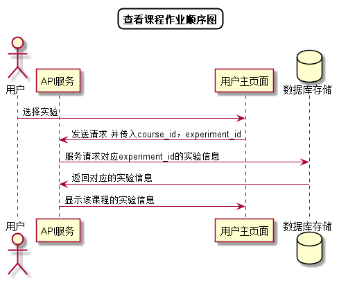

# “查看本课程作业”用例 [返回](../README.md)

## 1. 用例规约

|用例名称|查看本课程实验作业|
|-------|:-------------|
|功能|学生/老师查看指定课程实验任务的信息|
|参与者|学生，老师|
|前置条件| 登录成功，能访问该课程|
|后置条件||
|主事件流| 1. 用户点击查看实验任务按钮 2.系统根据课程号查询并返回实验任务信息 |
|备选事件流|1a. 如果该课程无实验未发布实验任务  &nbsp;&nbsp; 1.本课程暂无实验任务|

## 2. 业务流程[源码](../顺序图/查看课程作业.puml)

## 3. 界面设计
- 界面参照: https://duolalu.github.io/is_analysis/test6/ui/getexperiment.html
- API接口调用
    - 接口1：[getExperiments](../接口/getExperiments.md)

## 4. 算法描述 
  无
## 5. 参照表

- [COURSES](../数据库设计.md/#COURSES)
- [EXPERIMENTS](../数据库设计.md/#EXPERIMENTS)
- [SCOREITEM](../数据库设计.md/#SCOREITEM)
