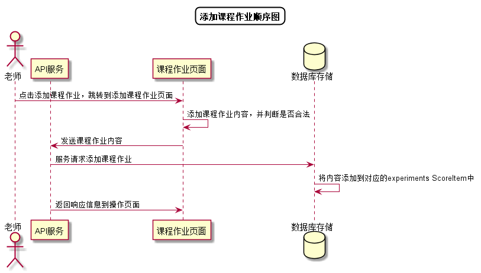

# “添加课程作业”用例 [返回](../README.md)

## 1. 用例规约

|用例名称|添加课程作业|
|-------|:-------------|
|功能|添加课程的作业|
|参与者|老师|
|前置条件|以老师的身份登录成功|
|后置条件||
|主事件流| 1. 老师点击添加课程作业 2.系统跳转到添加课程作业页面 3.老师输入课程作业后点击提交|
|备选事件流|1a. 老师误输入不合法的课程作业信息  &nbsp;&nbsp; 1.系统提示信息输入错误  &nbsp;&nbsp; 2.老师重新输入信息|

## 2. 业务流程[源码](../顺序图/添加课程作业.puml)

## 3. 界面设计
- 界面参照: https://duolalu.github.io/is_analysis/test6/ui/setexpermient.html
- API接口调用
    - 接口1：[setCourse](../接口/setCourse.md)

## 4. 算法描述 
无
    
## 5. 参照表
- [TEACHERS](../数据库设计.md/#TEACHERS)
- [COURSES](../数据库设计.md/#COURSES)
- [EXPERIMENTS](../数据库设计.md/#EXPERIMENTS)
- [SCOREITEM](../数据库设计.md/#SCOREITEM)
