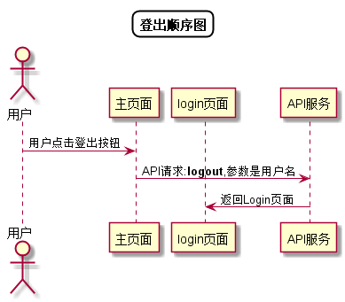

# “登出”用例 [返回](../README.md)

## 1. 用例规约

|用例名称|登出|
|-------|:-------------|
|功能|用户登出平台|
|参与者|学生，老师|
|前置条件| 登录成功|
|后置条件|成功登出|
|主事件流| 1.用户点击登出按钮 2.跳转到登录页面|
|备选事件流|1a.响应时间超时 &nbsp;&nbsp; 1.提示登出失败|

## 2. 业务流程
无

## 3. 界面设计
- 界面参照: https://duolalu.github.io/is_analysis/test6/ui/shome.html
- API接口调用
    - 接口1：[logout](../接口/logout.md)

## 4. 算法描述[源码](../顺序图/登出.puml)

    
## 5. 参照表

- [USERS](../数据库设计/数据库设计.md/#USERS)
