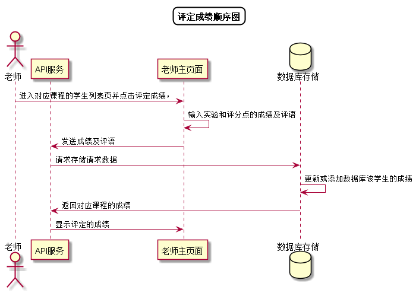

# “评定某学生成绩”用例 [返回](../README.md)

## 1. 用例规约

|用例名称|评定学生成绩|
|-------|:-------------|
|功能|评定学生的实验评分点成绩|
|参与者|老师|
|前置条件| 成功登录|
|后置条件||
|主事件流| 1. 老师选择一门课程并选择一位学生 2.系统显示该学生该课程的成绩列表 3.老师输入实验成绩和评分点成绩和相关评语|
|备选事件流|1a. 学生GitHub地址出错  &nbsp;&nbsp; 1.系统提示地址错误，老师无需评分 |

## 2. 业务流程 [源码](../顺序图/评定学生成绩.puml)
 

## 3. 界面设计
- 界面参照: https://duolalu.github.io/is_analysis/test6/ui/setscore.html
- API接口调用
    - 接口1：[setScore](../接口/setScore.md)

## 4. 算法描述 
    
## 5. 参照表

- [STUDENTS](../数据库设计.md/#STUDENTS)
- [COURSES_SCORES](../数据库设计.md/#COURSES_SCORES)
- [EXPERIMENTS_SCORES](../数据库设计.md/#EXPERIMENTS_SCORES)
- [SCOREITEM_SCORES](../数据库设计.md/#SCOREITEM_SCORES)
