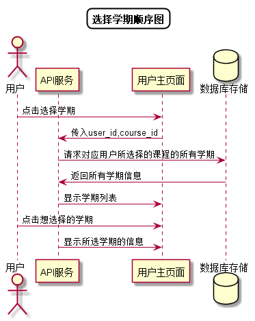

# “选择学期”用例 [返回](../README.md)

## 1. 用例规约

|用例名称|选择学期|
|-------|:-------------|
|功能|用户选择所修读或任教的学期|
|参与者|学生，老师|
|前置条件| 成功登录|
|后置条件||
|主事件流| 1. 用户点击选择学期 2.系统显示所修读或任教的学期列表（包括即将开始的新学期） 3.学生选择任意学期|
|备选事件流||

## 2. 业务流程
无

## 3. 界面设计
- 界面参照: https://duolalu.github.io/is_analysis/test6/ui/getterms.html
- API接口调用
    - 接口1：[getTerms](../接口/getTerms.md)

## 4. 算法描述 [源码](../顺序图/选择学期.puml)

    
## 5. 参照表
- [TEACHERS](../数据库设计.md/#TEACHERS)
- [STUDENTS](../数据库设计.md/#STUDENTS)
- [COURSES](../数据库设计.md/#COURSES)
