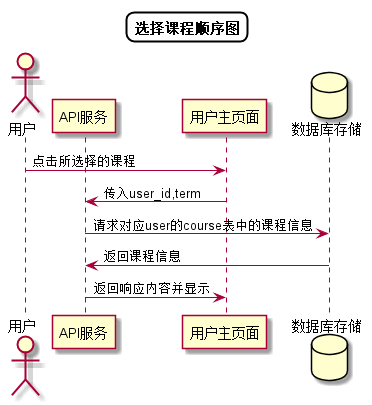

# “选择课程”用例 [返回](../README.md)

## 1. 用例规约

|用例名称|选择课程|
|-------|:-------------|
|功能|用户选择所选修或任教的课程|
|参与者|学生，老师|
|前置条件| 成功登录|
|后置条件||
|主事件流| 1. 用户点击选择课程 2.系统显示用户课程列表 3.用户选择任意课程|
|备选事件流|1a. 用户未选修或任教任何课程  &nbsp;&nbsp; 1.返回空列表   &nbsp;&nbsp;|

## 2. 业务流程
无

## 3. 界面设计
- 界面参照: 老师： https://duolalu.github.io/is_analysis/test6/ui/shome.html  学生： https://duolalu.github.io/is_analysis/test6/ui/shome.html
- API接口调用
    - 接口1：[getCourses](../接口/getCourses.md)

## 4. 算法描述 [源码](../顺序图/选择课程.puml)

    
## 5. 参照表
- [TEACHERS](../数据库设计.md/#TEACHERS)
- [STUDENTS](../数据库设计.md/#STUDENTS)
- [COURSES](../数据库设计.md/#COURSES)
